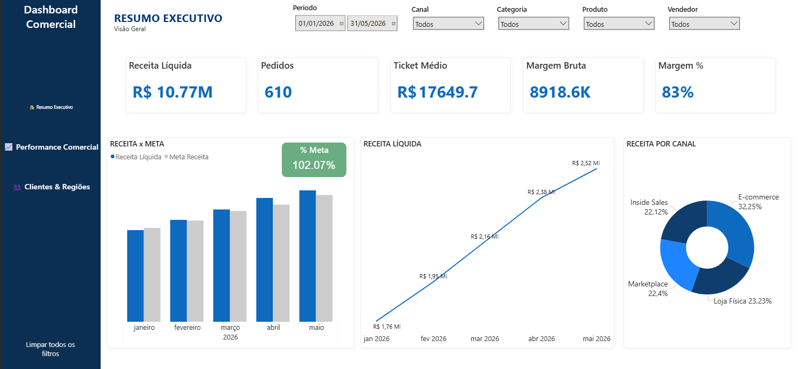
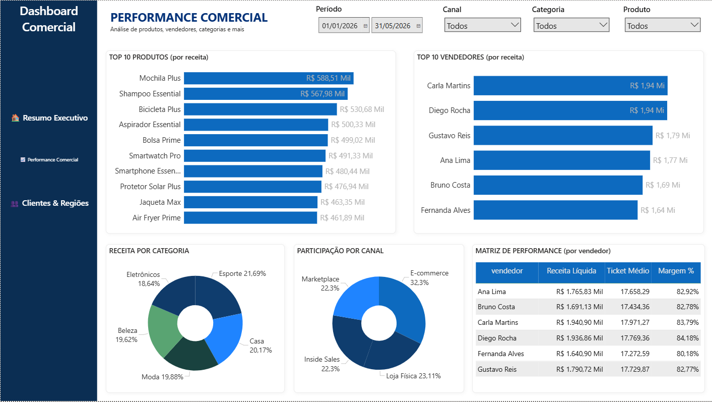
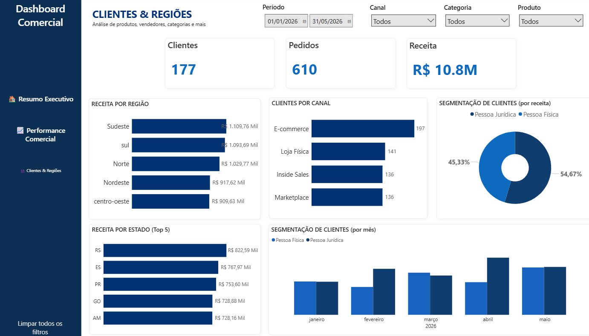

# 🇧🇷 Dashboard Comercial de Vendas | Power BI + Python

## Sobre o Projeto

Este projeto foi desenvolvido como um case para em análise de dados, tratamento de dados, modelagem dimensional e desenvolvimento de dashboards executivos utilizando Power BI e Python.

## Objetivos de Negócio

- Monitorar a evolução da receita ao longo do tempo
- Comparar resultado realizado versus meta
- Identificar os produtos mais rentáveis
- Avaliar o desempenho dos vendedores
- Analisar a participação dos canais de venda
- Entender o comportamento dos clientes por região

## Tecnologias Utilizadas

- Power BI
- Power Query
- DAX
- Python
- Pandas
- Excel

## Dashboard

### Resumo Executivo

### Performance Comercial

### Clientes & Regiões

---

# 🇺🇸 Sales Performance Dashboard | Power BI + Python

## About the Project

This project was developed as a portfolio case to data analysis, data cleaning, dimensional modeling and business intelligence using Power BI and Python.

## Business Goals

- Monitor revenue performance over time
- Compare actual results against targets
- Identify the most profitable products
- Evaluate sales representative performance
- Analyze sales channel participation
- Understand customer behavior by region

## Technologies

- Power BI
- Power Query
- DAX
- Python
- Pandas
- Excel

## Dashboard

### Executive Summary

### Sales Performance

### Customers & Regions

